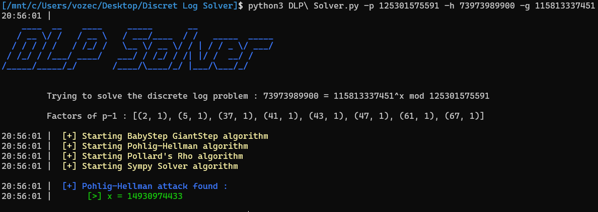

# DLP-Solver
This tool is used to solve the discrete logarithm problem

# Discrete Log Problem
We search a ``x`` satisfying ``h=g^x mod p`` for given h,g,p

# Algorithms:
- Baby-Step Giant-Step algorithm
- Pohlig-Hellman algorithm
- Pollard's rho algorithm
- Sympy Solver

# Usage:
```bash
python3 DLP\ Solver.py -g ... -p ... -h ...
```

#Example:



*This tools was inspired by many writings/codes of other people from previous CTF Writeup*
